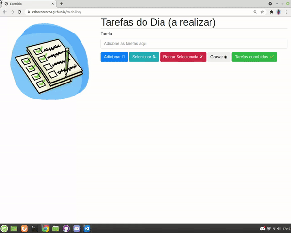

<h1 align="center"> to-do list </h1>
 
 
 
 
 
 
 

 
 
 > status: Developing ⚠️
 
 
 
 ## How to use this algorithm?

1. First add your daily tasks or tasks to be performed
     + These are tasks in general, they don't have to be routines, you are free to do as you wish
2. Select any listing of yours
     + You can browse the listings with the "Select" button so you can access one by one of your listings.
3. remove the selected
     + You can also delete your listing, how to do that? simple! Walk with the "select" button to the listing you want to delete, and just click the "Remove selected" button
4. save your list     
     + To permanently save your list, just click "Save" and then the list will be saved in your browser so don't worry about closing or turning off your browser, it will stay until you execute the next function.
5. complete your tasks
     + Last but not least, mark your added tasks as completed, of course only if you've actually completed 😅. Soon after, the system will delete the list and a completed message will appear!
     
     
     
## What does this algorithm consist of?

Well! Let's talk about what this algorithm consists of. Basically this is a BETA algorithm is still in "construction", but its purpose is basically to have a web application of a kind of notepad, and be as simple as possible to use, as the client will not need to download and will not lose the list if it closes or something happens that it has to leave the page.

## Technologies used

<table> 
 <tr>
  <td>JavaScript</td>
  <td>HTML</td>
  <td>CSS</td>
  <td> BOOTSTRAP</td>
 </tr>
 <tr> 
  <td> ECMAS v8.0</td>
  <td> v5.0 </td>
  <td>v3.0</td>
  <td>v4.0.0</td>
 </tr>
</table>

## License
Repository covered by [MIT](http://escolhaumalicenca.com.br/licencas/mit/) license
